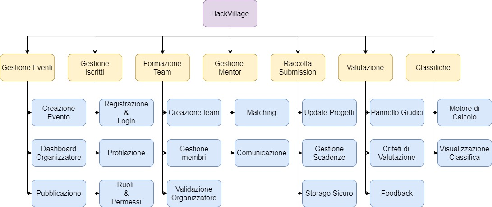

# Requirement Breakdown Structure
L'RBS definisce l'architettura funzionale di HackVillage, scomponendo il sistema nelle sue macro-aree operative per garantire una copertura completa del ciclo di vita dell'hackathon.

## 1. Gestione eventi
- **Creazione evento**: configurazione di date, descrizione, regole e premi.
- **Dashboard organizzatore**: monitoraggio in tempo reale degli iscritti e dello stato di avanzamento.
- **Pubblicazione**: gestione dello stato dell'evento (bozza, aperto, in corso, concluso).

## 2. Gestione iscritti
* **Registrazione & Login**: sistema di autenticazione sicuro per partecipanti, mentor e giudici.
* **Profilazione**: gestione delle competenze tecniche e dei ruoli utente.
* **Ruoli & Permessi**: controllo accessi differenziato (RBAC) per garantire la sicurezza dei dati.

## 3. Formazione team
* **Creazione team**: funzionalità per la creazione autonoma dei team da parte dei partecipanti.
* **Gestione membri**: inviti, accettazione e rimozione dai team.
* **Validazione organizzatore**: strumenti per la supervisione e la validazione dei team formati.

## 4. Gestione mentor
* **Matching**: assegnazione dei mentor ai team in base alle competenze necessarie.
* **Comunicazione**: canali dedicati per il supporto mentor-team.

## 5. Raccolta submission
* **Upload progetti**: sistema sicuro per il caricamento di file, repository GitHub o link esterni.
* **Gestione scadenze**: blocco automatico dei caricamenti al termine della finestra temporale.
* **Storage sicuro**: archiviazione dei file sottomessi con protezione dei dati.

## 6. Valutazione
* **Pannello giudici**: interfaccia dedicata per la visualizzazione dei progetti e l'assegnazione dei punteggi.
* **Criteri di valutazione**: configurazione dei parametri di voto (es. innovazione, fattibilità tecnica, design).
* **Feedback**: spazio per inserire commenti qualitativi oltre ai punteggi numerici.

## 7. Classifiche
* **Motore di calcolo**: elaborazione automatica dei punteggi finali.
* **Visualizzazione classifica**: pubblicazione in tempo reale della classifica pubblica al termine della valutazione.

