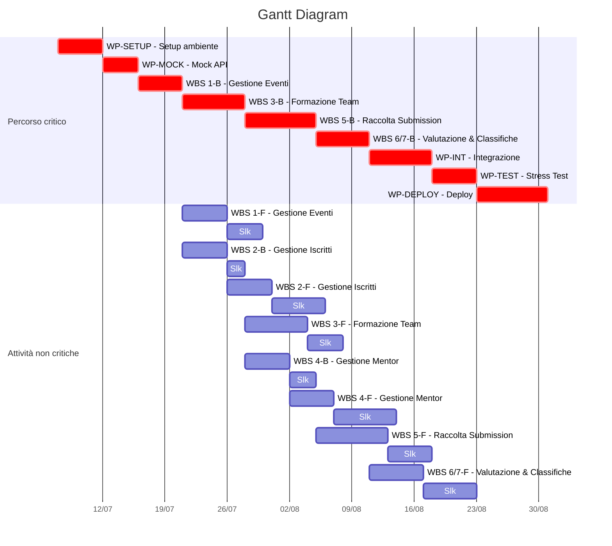

# Diagramma di Gantt
Il diagramma di Gantt è stato realizzato a partire dal [PND](PND.md) definito in fase di pianificazione.

Tale diagramma rappresenta in modo chiaro e sintetico la pianificazione temporale del progetto. Attraverso il Gantt è stato possibile inoltre visualizzare i percorsi critici, che potrebbero portare a futuri rallentamenti.

