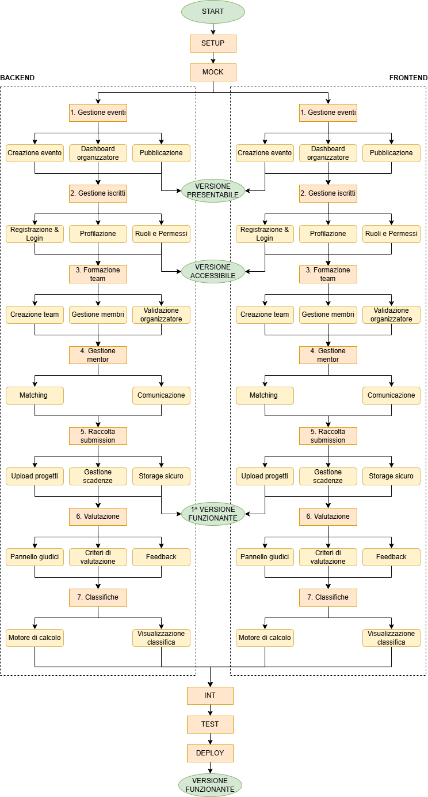

# Project Network Diagram

Il PND rappresenta la mappa logica e sequenziale delle interdependenze tecnologiche tra i diversi work packages definiti nella [WBS](WBS.md). 

Dato il vincolo temporale stringente di 3 mesi (12 settimane, pari a circa 60 giorni lavorativi) e la composizione ridotta del team di sviluppo, la pianificazione reticolare adotta un approccio _API-first_. Questa scelta strategica permette di disaccoppiare i flussi di lavoro, consentendo lo sviluppo parallelo dell'interfaccia grafica (frontend) e delle logiche server-side (backend) per ciascuna macro-area, azzerando i tempi morti e ottimizzando i tempi di rilascio.

## Tecniche di stima e allocazione temporale
La stima della complessità delle attività necessarie a sviluppare l'MVP di HackVillage è stata effettuata dal team utilizzando la tecnica del **Planning Poker** basata sulla scala di Fibonacci modificata. Questa metodologia ha permesso di quantificare lo sforzo relativo di ogni pacchetto di lavoro attraverso gli **Story Points (SP)**.

Il team di sviluppo ha una **velocity** stimata di **38 Story Points per sprint** (pari a circa 19 SP a settimana). Il totale dello sforzo stimato per l'intero MVP è di **228 SP**, il che riflette esattamente la capacità produttiva del team distribuita sulle 12 settimane di calendario.

**Nota**: nel calcolo della durata del progetto, gli Story Points quantificano lo *sforzo complessivo* (backend + frontend combinati), mentre la durata in giorni lavorativi inserita nel diagramma di Gantt rappresenta l'*elapsed time* (tempo effettivo di calendario lavorativo). Poiché il team lavora in parallelo su due binari separati (Frontend e Backend), la durata temporale di una fase corrisponde alla finestra temporale massima necessaria per assorbire lo sviluppo della componente più complessa (tipicamente il backend), e non alla somma matematica lineare degli sforzi.

## Work packages

Di seguito si riporta la scomposizione temporale dei macroblocchi di lavoro. Le durate riflettono l'effettiva schedulazione delle attività sul calendario delle 12 settimane, tenendo conto delle sovrapposizioni e dei parallelismi reali applicati nel file di pianificazione.

| Macro-attività | Sforzo (Story Points) | Durata | Descrizione |
| :--- | :---: | :---: | :--- |
| **WP-SETUP** | 13 SP | 5 gg | Configurazione ambienti cloud, cifratura password e modellazione DB. |
| **WP-MOCK** | 8 SP | 4 gg | Definizione contratti delle rotte, permette a frontend e backend di lavorare in parallelo. |
| **WBS 1: Gestione Eventi** | 34 SP | 5 gg | Sviluppo logiche di switch di stato e aggregazione dati per dashboard organizzatore. |
| **WBS 2: Gestione Iscritti** | 21 SP | 5 gg | Implementazione middleware di sicurezza basati su ruoli e routing condizionale. |
| **WBS 3: Formazione Team** | 34 SP | 7 gg | Alta complessità algoritmica per gestione stati d'invito e relazioni N-N. |
| **WBS 4: Gestione Mentor** | 21 SP | 5 gg | Sviluppo interfaccia drag-and-drop di assegnazione e bacheca di supporto. |
| **WBS 5: Raccolta Submission** | 55 SP | 8 gg | **Punto critico (SWOT):** isolamento cartelle e gestione flussi pesanti simultanei. |
| **WBS 6: Valutazione** | 24 SP | 6 gg | Sviluppo endpoint e interfacce per la distribuzione dei progetti ai giudici e voto ponderato. |
| **WBS 7: Classifiche** | 18 SP | 3 gg | Sviluppo query SQL per il calcolo in tempo reale dei posizionamenti (eseguito in parallelo a WBS 6). |
| **WP-INTEGRATION** | - | 7 gg | Unione binari di sviluppo frontend e backend e allineamento con dati reali. |
| **WP-TEST** | - | 5 gg | Simulazione carico dell'ultimo minuto sulla submission progetti prima della scadenza. |
| **WP-DEPLOY** | - | 3 gg | Collaudo finale con stakeholder, bug fixing finale, UAT e rilascio in produzione. |
| **DURATA COMPLESSIVA** | **228 SP** | **60 giorni totali** | Schedulazione su 12 settimane complessive di calendario. |

**Nota**: la WBS 7 (3 gg) viene avviata in parallelo all'interno della finestra temporale della WBS 6 (6 gg). Similmente, le componenti frontend e backend delle altre WBS avanzano in contemporanea disaccoppiando lo sforzo.

## Logica precedenze
Tutti i legami di precedenza all'interno del diagramma seguono la logica **Finish-to-Start (FS)**: un'attività successiva non può iniziare se l'attività precedente non è stata completata. 

Grazie all'approccio *API-first*, dopo il completamento del pacchetto **WP-MOCK**, lo sviluppo si sdoppia formalmente in **due binari paralleli** per tutta la durata delle fasi centrali (dalla WBS 1 alla WBS 7):
* **B - Backend (Daniele Merighi):** focalizzato sulla scrittura degli endpoint API, script SQL, configurazione dei middleware e gestione del database Cloud.
* **F - Frontend (Daniel Meco):** focalizzato sulla costruzione delle interfacce utente (UI/UX), gestione dello stato del client, routing condizionale e interazione con le API mockate.

I due binari convergono tassativamente al nodo **WP-INTEGRATION**, dove le interfacce grafiche vengono collegate agli endpoint backend reali.

## Percorso critico

Applicando l'algoritmo del metodo del percorso critico (**CPM**), ovvero effettuando i passaggi in avanti (*Forward Pass*) e all'indietro (*Backward Pass*) sulla rete delle attività, il team ha identificato la catena a "scorrimento zero" (Slack pari a 0).

Il percorso critico del progetto (riportato in grassetto nella tabella sottostante) è in larga parte guidato e vincolato dallo **sviluppo delle componenti di backend**, in quanto presentano una complessità strutturale, algoritmica e di sicurezza intrinsecamente maggiore rispetto alla controparte client-side.

### Tabella di valutazione dello slack

Di seguito viene riportata la matrice del calcolo dei tempi della rete, che evidenzia i margini di flessibilità delle attività non critiche (sviluppate principalmente sul binario Frontend o su moduli assorbiti dai parallelismi).

| ID attività | Descrizione | Durata (Giorni) | Slack (margine di ritardo) | Stato attività |
| :--- | :--- | :---: | :---: | :--- |
| **WP-SETUP** | Setup iniziale ambiente & architettura DB | 5 | 0 giorni | **CRITICO** |
| **WP-MOCK** | Progettazione contratti & mock API core | 4 | 0 giorni | **CRITICO** |
| **WBS 1-B** | Backend gestione eventi (1.1.2, 1.2.1, 1.3.1) | 5 | 0 giorni | **CRITICO** |
| WBS 1-F | Frontend gestione eventi (1.1.3, 1.2.2, 1.3.2) | 5 | 4 giorni | Non Critico |
| WBS 2-B | Backend gestione iscritti (2.1.2, 2.2.2, 2.3.1) | 5 | 2 giorni | Non Critico |
| WBS 2-F | Frontend gestione iscritti (2.1.4, 2.2.3, 2.3.3) | 5 | 6 giorni | Non Critico |
| **WBS 3-B** | Backend formazione team (3.1.1, 3.1.2, 3.2.1) | 7 | 0 giorni | **CRITICO** |
| WBS 3-F | Frontend formazione team (3.1.3, 3.2.2, 3.3.2) | 7 | 4 giorni | Non Critico |
| WBS 4-B| Backend gestione mentor (4.1.1, 4.1.2, 4.2.1) | 5 | 3 giorni | Non Critico |
| WBS 4-F | Frontend gestione mentor (4.1.3, 4.2.2) | 5 | 7 giorni | Non Critico |
| **WBS 5-B** | Backend raccolta submission (5.1.1, 5.1.2, 5.2.1) | 8 | 0 giorni | **CRITICO** |
| WBS 5-F | Frontend raccolta submission (5.1.3, 5.2.2) | 8 | 5 giorni | Non Critico |
| **WBS 6-B** | Backend valutazione (6.1.1, 6.2.1, 6.2.2, 6.3.1) | 6 | 0 giorni | **CRITICO** |
| WBS 6-F | Frontend valutazione (6.1.2, 6.2.3, 6.3.2) | 6 | 6 giorni | Non Critico |
| WBS 7-B | Backend motore di calcolo classifiche (7.1.1, 7.1.2) | 3 | 3 giorni | Non Critico |
| WBS 7-F | Frontend visualizzazione classifiche (7.2.1, 7.2.2) | 3 | 3 giorni | Non Critico |
| **WP-INT** | Code integration & allineamento (.1.4) | 7 | 0 giorni | **CRITICO** |
| **WP-TEST** | Stress test modulo 5 & simulazione carico | 5 | 0 giorni | **CRITICO** |
| **WP-DEPLOY**| Rilascio, UAT finale con stakeholder e lancio | 3 | 0 giorni | **CRITICO** |

### Nota di gestione del rischio operativo
Lo sviluppatore frontend (Daniel Meco) gode di un margine di scorrimento fluttuante tra i 4 e i 7 giorni lavorativi lungo le sue attività. Questo significa che, in caso di colli di bottiglia sul percorso critico del backend, lo Scrum Master Gabriele Arcese può riallocare temporaneamente Daniel Meco su compiti di supporto logico, code review o testing, assorbendo le criticità senza causare alcuno slittamento sulla data di consegna finale.

# [⬅️ Planning](../../2-planning.md)
